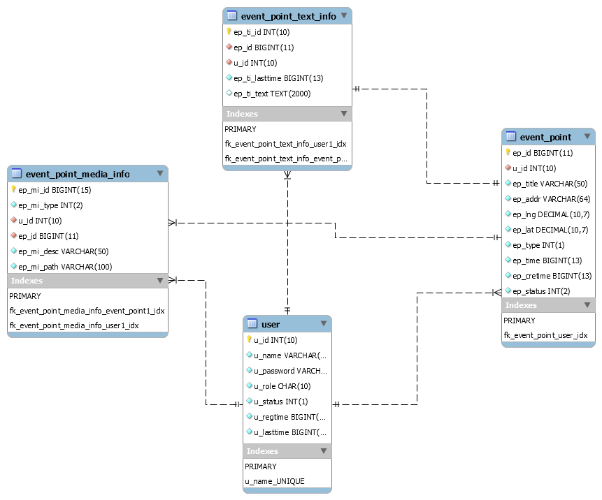

# 记录去过地点的个人应用（后端部分）


## 一、编译环境与运行

### 1.环境

> - JDK 1.8+
> - MAVEN 3.6.0+
> - MySQL 8.0+
> - SpringBoot 2.2.1+

### 2.编译

- 清除 `mvn clean`
- 构建 `mvn build`
- jar运行包位置 `tm-web/target/tm-web-xxx.jar`


## 二、项目结构

### 项目模块结构如下：

```
tm
|
|--  tm-comm
        |-- utils
        |-- vo
|--  tm-repo
        |-- datasource
        |-- mybatis
|--  tm-service
        |-- AccountService
        |-- EpointService
|--  tm-web
        |-- controller
        |-- security
        |-- vo(web)
        |-- filter        
```

### 各个模块功能

* **tm** ：项目父模块，可在依赖中更新子模块版本，切换开发版本和发布版本配置。
    * [**tm-comm**](./tm-comm/README.md)：各模块的公共模块，提供工具和通用数据类。
    * [**tm-repo**](./tm-repo/README.md)：与各种数据源交互提供对外数据访问的子模块。
    * [**tm-service**](./tm-service/README.md)：提供各种服务，完成义务部分的子模块。
    * [**tm-web**](./tm-web/README.md)：实现控制层相关代码的子模块。
                 
## 三、WEB接口列表


## 四、数据库设计

当前版本[**数据库设计v1.2**](./script/db_design_v1.2.sql)的EER关系图如下：<br/>




