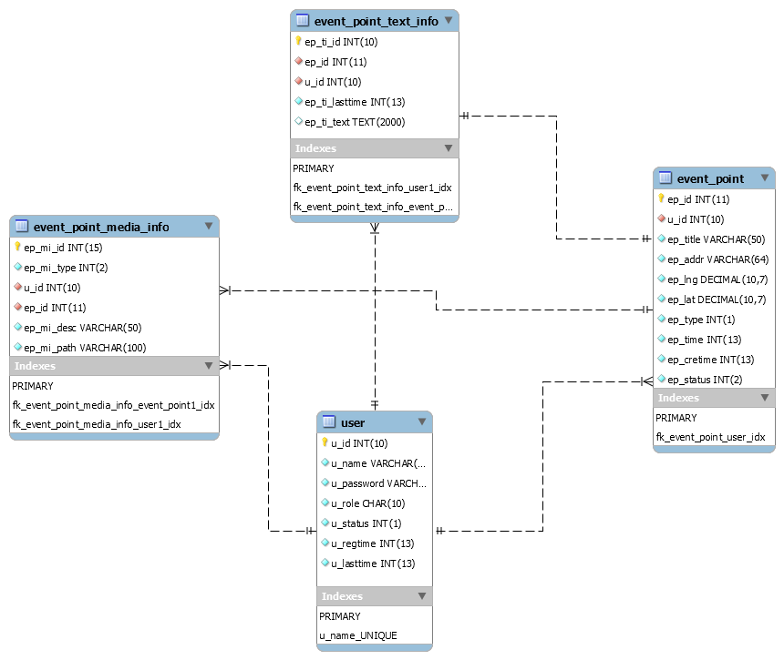

# 记录去过地点的个人应用（后端部分）

## 一、项目结构

### 1.父模块 travelmemories

### 2.子模块 tm-comm

### 3.子模块 tm-repo

### 4.子模块 tm-service

### 5.子模块 tm-web

---

## 二、编译环境与运行

### 1.环境

> - JDK 1.8+
> - MAVEN 3.6.0+
> - MySQL 8.0+
> - SpringBoot 2.2.1+

### 2.编译

- 清除 `mvn clean`
- 构建 `mvn build`

## 三、数据库设计

当前版本[**数据库设计**](./script/tm_db_design.sql)的EER关系图如下： 

---

